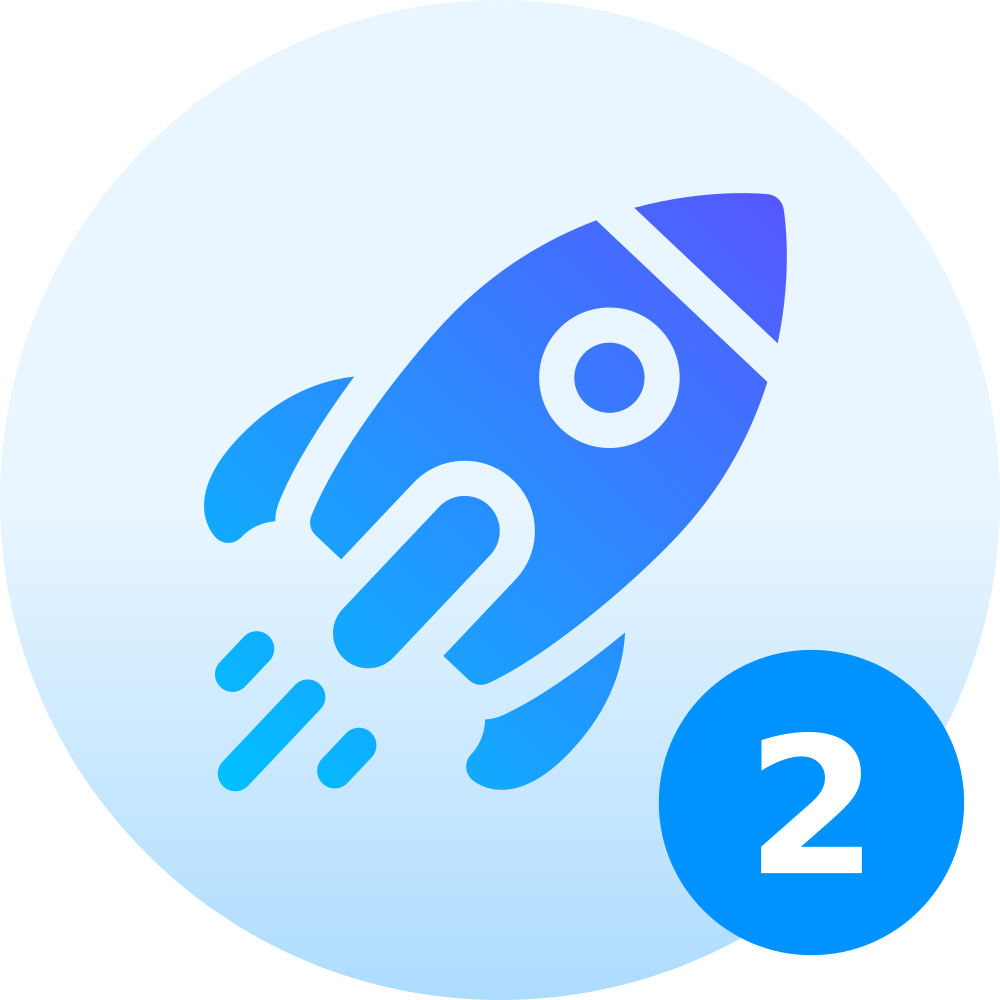
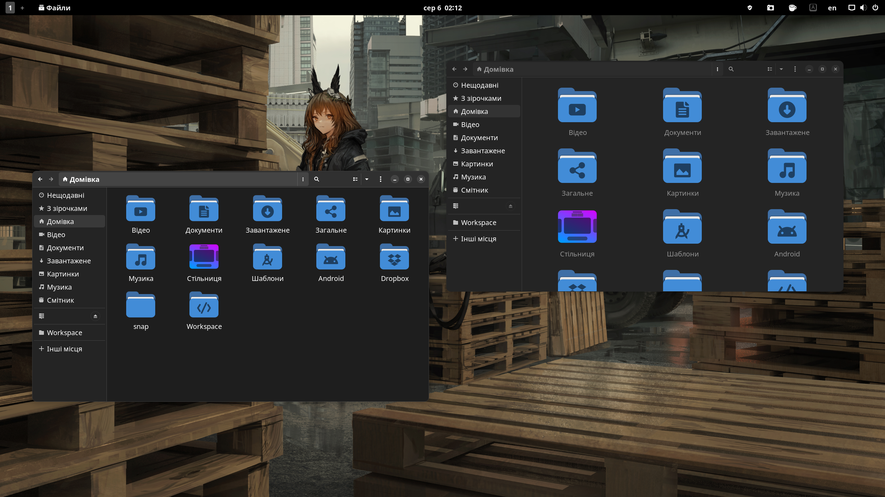
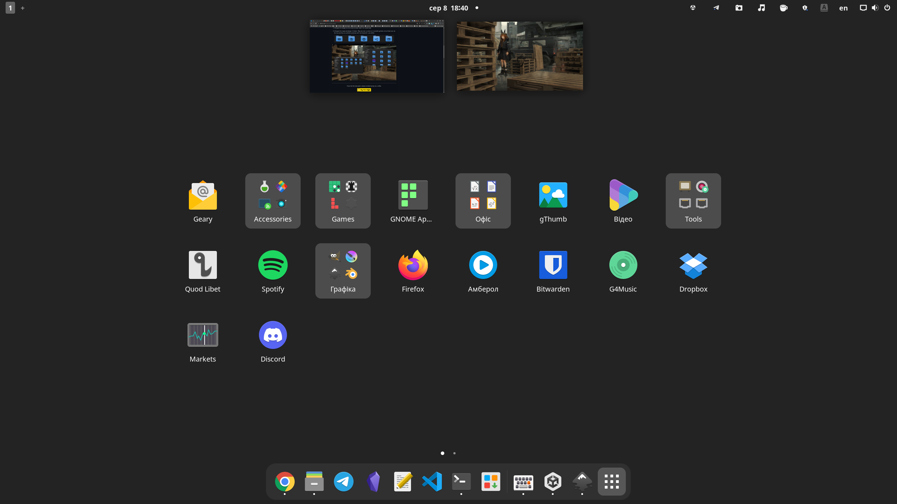
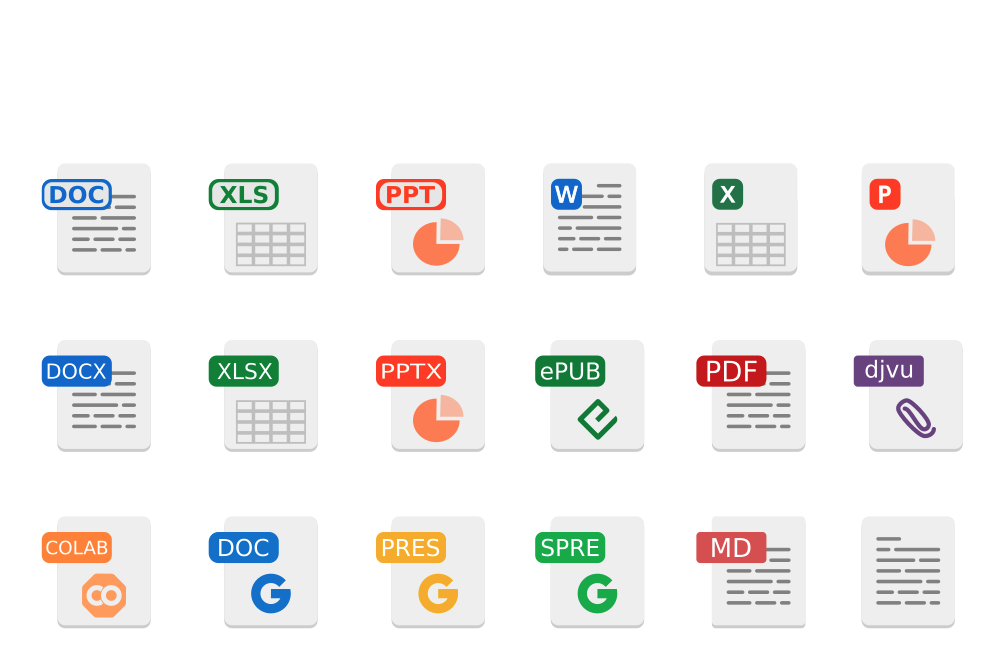
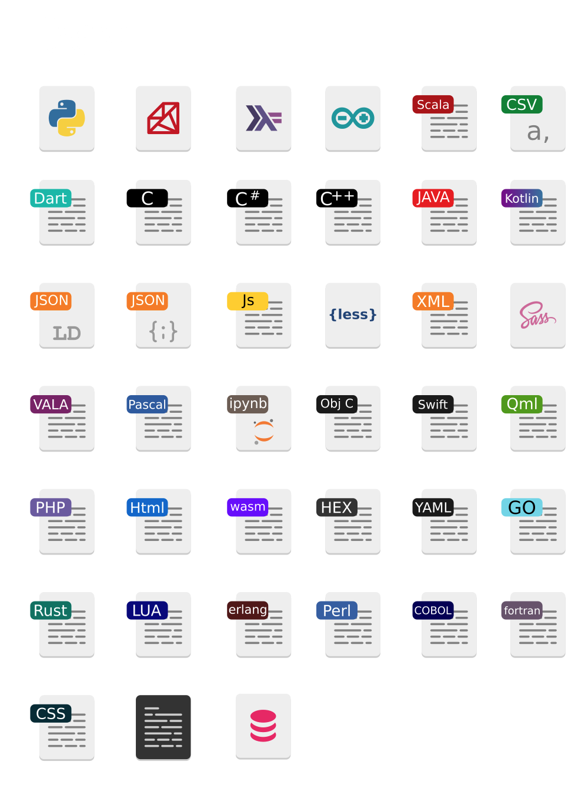
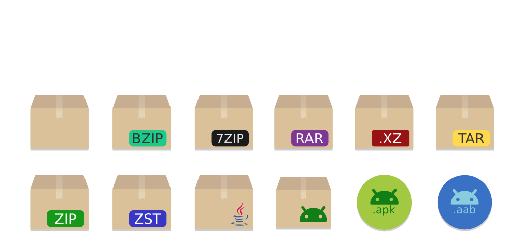
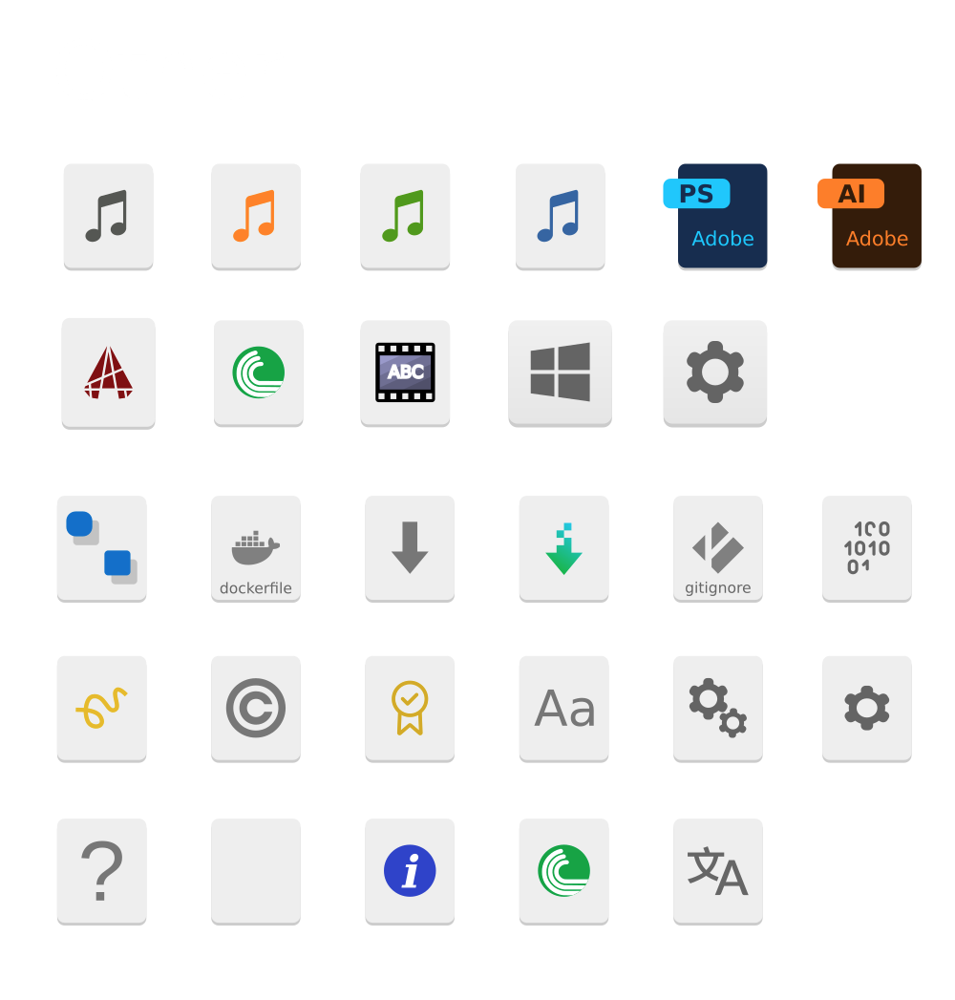

    

Marwaita2 is an icon pack for Linux. This solution is a fork of the [original](https://github.com/darkomarko42/Marwaita-Icons) icon pack (but it's still the same old implementation with filetype labels, for those who remember and love). 

This fork includes some modifications and changes. Below you can see some key differences:

1) Changed the design of some icons to better match the overall style.

2) Changed the shape and design of folders. They are now rounded and have bold symbols on the folder icon. As for me, now they are perfectly combined with the Gnome UI. Look at this:

    

    

    

___

 
If you like this icons pack, please consider buying me a coffee:

  

___

3) The mimetypes for the following files have been added to this icon pack. This is really cool for developers as it allows you to quickly browse files by type. For example:

    

    

    

    

Added or changed:
epub, json, json-ld, doc, xls, ppt, xlsx, pptx, docx, colab, google doc, google pres, google spre, ipynb, djvu, csv, dockerfile, erlang, haskell, kotlin, objective c, scala, swift, dart, image, php, css, perl, 7zip, aab, acad, apk, illustrator, psd, less, sass, cobol, fortran, pascal, vala, flatpak, hex, lua, markdown, readme, certificatem yaml, tar, arduino, binary, sql, wasm, bzip, rar, tar, C#, C++, C, Swift, Obj C, erlang, go, haskell, hex, go, kotlin, lua, ruby, rust, sl ...
